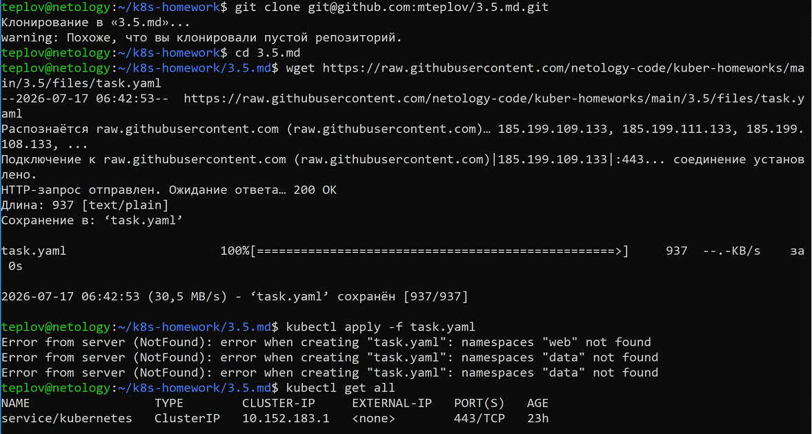
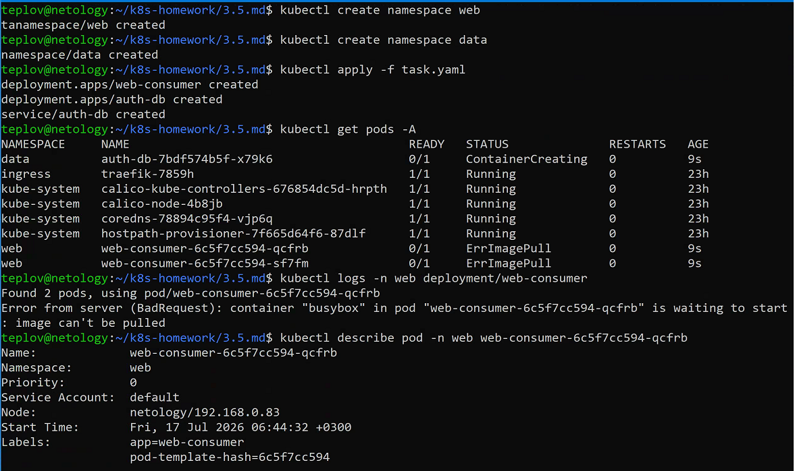
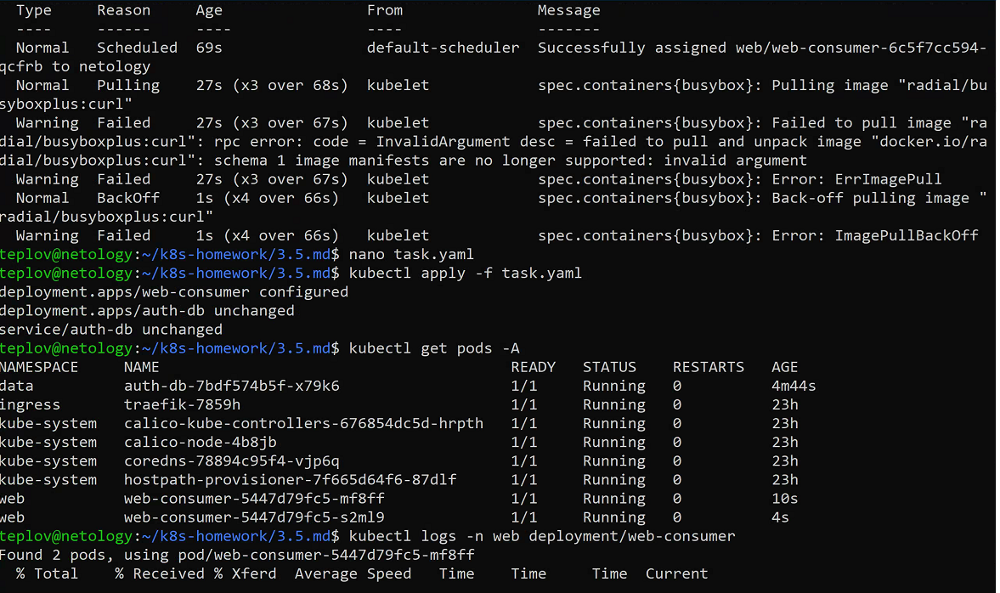
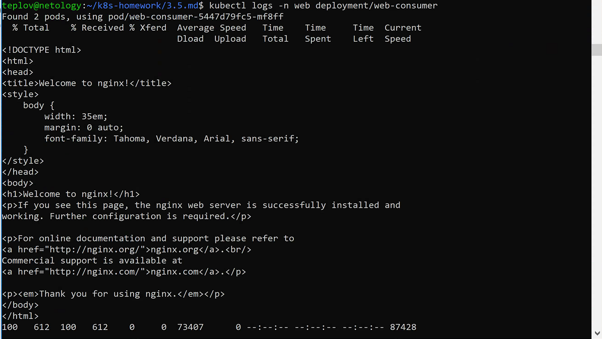

# Домашнее задание к занятию Troubleshooting Теплов Михаил
 
### Цель задания

Устранить неисправности при деплое приложения.

### Чеклист готовности к домашнему заданию

1. Кластер K8s.

### Задание. При деплое приложение web-consumer не может подключиться к auth-db. Необходимо это исправить

1. Установить приложение по команде:
```shell
kubectl apply -f https://raw.githubusercontent.com/netology-code/kuber-homeworks/main/3.5/files/task.yaml
```
2. Выявить проблему и описать.
3. Исправить проблему, описать, что сделано.
4. Продемонстрировать, что проблема решена.






### Правила приёма работы

1. Домашняя работа оформляется в своём Git-репозитории в файле README.md. Выполненное домашнее задание пришлите ссылкой на .md-файл в вашем репозитории.
2. Файл README.md должен содержать скриншоты вывода необходимых команд, а также скриншоты результатов.
3. Репозиторий должен содержать тексты манифестов или ссылки на них в файле README.md.

## Выполнение работы

### 1. Создание пространств имен

Перед развертыванием приложения были созданы необходимые пространства имен:

```bash
kubectl create namespace web
kubectl create namespace data
```

---

### 2. Развертывание приложения

```bash
kubectl apply -f task.yaml
```

---

### 3. Выявление проблемы

После развертывания приложение `web-consumer` не запускалось.

Проверка состояния Pod:

```bash
kubectl get pods -A
```

Результат:

```
ImagePullBackOff
```

Для определения причины была выполнена диагностика:

```bash
kubectl describe pod -n web <pod-name>
```

Получена ошибка:

```
schema 1 image manifests are no longer supported
```

Причина — образ `radial/busyboxplus:curl` использует устаревший Docker Image Manifest Schema v1, который не поддерживается современными версиями Kubernetes.

---

### 4. Исправление проблемы

#### Исправление №1

Заменен образ контейнера.

Было:

```yaml
image: radial/busyboxplus:curl
```

Стало:

```yaml
image: curlimages/curl:8.8.0
```

#### Исправление №2

После запуска контейнера выяснилось, что приложение обращалось к сервису `auth-db` по короткому DNS-имени:

```bash
curl auth-db
```

Так как сервис расположен в пространстве имен `data`, короткое имя не разрешалось.

Команда была изменена на:

```bash
curl auth-db.data
```

---

### 5. Применение изменений

```bash
kubectl apply -f task.yaml
```

---

### 6. Проверка результата

Проверка состояния Pod:

```bash
kubectl get pods -A
```

Результат:

```
web    web-consumer   Running
data   auth-db        Running
```

Проверка работы приложения:

```bash
kubectl logs -n web deployment/web-consumer
```

Получен ответ от сервиса:

```
Welcome to nginx!
```

Это подтверждает успешное подключение приложения `web-consumer` к сервису `auth-db`.

---

# Использованные команды

```bash
kubectl create namespace web
kubectl create namespace data

kubectl apply -f task.yaml

kubectl get pods -A

kubectl describe pod -n web <pod-name>

kubectl logs -n web deployment/web-consumer
```

---

# Использованные манифесты

- [task.yaml](task.yaml)

---
